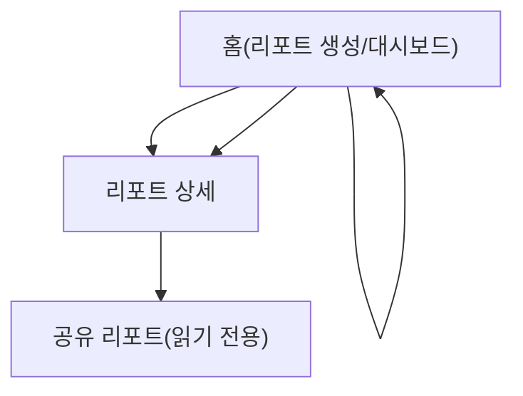

## 1. Product Overview

GitHub URL/브랜치/기간(KST 고정)을 입력하면 커밋 diff를 GitHub API로 수집하고 OpenAI로 분석해, 공유 가능한 리포트 카드(제목/기여자/머메이드/마크다운/비교 결과)를 생성하는 웹앱.
개발 팀/개인 개발자가 “변경 사항을 빠르게 요약·시각화·비교”하도록 돕는다.

## 2. Core Features

### 2.1 Feature Module

요구사항은 다음의 최소 페이지로 구성된다:

1. **홈(리포트 생성/대시보드)**: GitHub 입력 폼, 생성 진행/결과 목록, 비교(성능/벤치마크) 실행.
2. **리포트 상세**: 리포트 카드 렌더링(제목/기여자/머메이드/마크다운), 내보내기/공유 링크 생성.
3. **공유 리포트(읽기 전용)**: 공유 링크로 접근하는 공개 뷰(마크다운+머메이드 포함).

### 2.2 Page Details

| Page Name      | Module Name | Feature description                                       |
| -------------- | ----------- | --------------------------------------------------------- |
| 홈(리포트 생성/대시보드) | 입력 폼        | GitHub URL, 브랜치, 기간(시작/종료, KST 고정) 입력 및 유효성 검사(필수값/형식).   |
| 홈(리포트 생성/대시보드) | 분석 실행       | GitHub API로 커밋/파일 diff 수집 후 OpenAI 분석 작업을 시작하고 진행 상태를 표시. |
| 홈(리포트 생성/대시보드) | 결과 목록       | 생성된 리포트 목록을 표시하고 상세로 이동.                                  |
| 홈(리포트 생성/대시보드) | 비교 실행       | 선택한 2개 리포트의 **성능 비교** 및 **벤치마크 비교** 결과를 요청/표시.            |
| 리포트 상세         | 카드 요약       | 리포트 제목, 분석 기간/브랜치, 기여자(Top 기여/변경량) 요약을 카드로 표시.            |
| 리포트 상세         | 머메이드 다이어그램  | 분석 결과로 생성된 Mermaid 다이어그램을 렌더링(파싱 오류 시 대체 안내).             |
| 리포트 상세         | 마크다운 리포트    | OpenAI가 생성한 Markdown 본문을 렌더링(코드블록 포함).                    |
| 리포트 상세         | 공유/내보내기     | 공유 링크 생성(읽기 전용), 링크 복사, Markdown 다운로드.                    |
| 공유 리포트(읽기 전용)  | 공개 렌더링      | 공유 링크로 접근 시 리포트 카드/머메이드/마크다운을 읽기 전용으로 표시.                 |

## 3. Core Process

* 리포트 생성 플로우: 홈에서 GitHub URL/브랜치/기간(KST)을 입력 → 분석 실행 → 서버가 GitHub API로 커밋 및 diff를 수집 → OpenAI로 요약/카드(제목, 기여자 요약, Mermaid, Markdown, 비교용 지표) 생성 → 완료된 리포트를 목록과 상세에서 확인.

* 공유 플로우: 리포트 상세에서 공유 링크 생성 → 공유용 URL을 복사 → 수신자는 공유 리포트 페이지에서 읽기 전용으로 열람.

* 비교 플로우: 홈에서 2개 리포트 선택 → 성능 비교/벤치마크 비교 실행 → 비교 결과를 같은 화면에 요약 표시.

