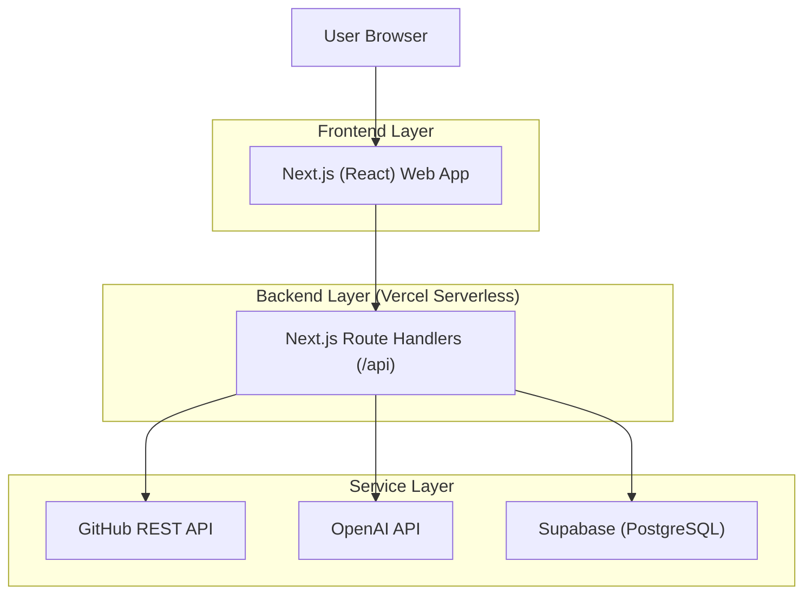
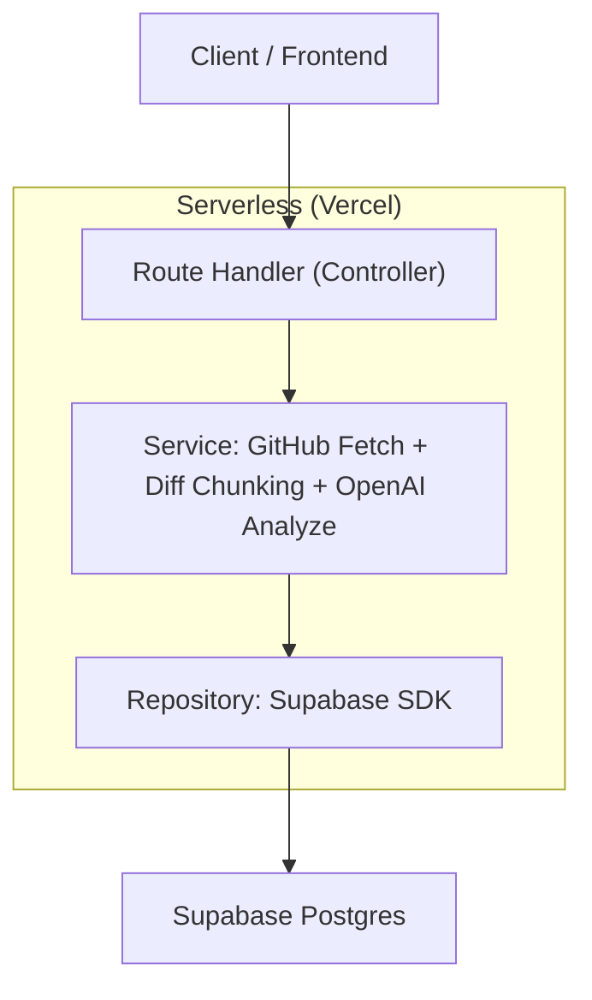
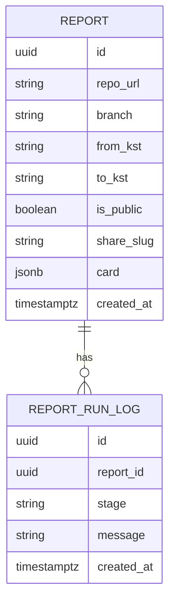

## 1.Architecture design


## 2.Technology Description
- Frontend: Next.js@14 (React@18) + TypeScript + tailwindcss@3
- Backend: Next.js Route Handlers (Serverless on Vercel)
- Database: Supabase (PostgreSQL)

## 3.Route definitions
| Route | Purpose |
|---|---|
| / | GitHub 입력 폼, 생성 상태, 리포트 목록, 비교 실행(성능/벤치마크) |
| /reports/:id | 리포트 상세(카드/머메이드/마크다운, 공유/내보내기) |
| /share/:slug | 공유 리포트 읽기 전용 뷰 |

## 4.API definitions (If it includes backend services)
### 4.1 Core API
- 리포트 생성
```
POST /api/reports/generate
```
Request:
| Param Name| Param Type | isRequired | Description |
|---|---:|---:|---|
| repoUrl | string | true | GitHub repo URL (e.g. https://github.com/org/repo) |
| branch | string | true | Branch name |
| fromKst | string | true | ISO datetime string, KST fixed |
| toKst | string | true | ISO datetime string, KST fixed |
| githubToken | string | false | Optional PAT for higher rate limits (not stored) |

- 리포트 조회
```
GET /api/reports/:id
```
- 공유 링크 생성
```
POST /api/reports/:id/share
```
- 비교
```
POST /api/reports/compare
```
Request:
| Param Name| Param Type | isRequired | Description |
|---|---:|---:|---|
| leftReportId | string | true | 비교 기준 리포트 ID |
| rightReportId | string | true | 비교 대상 리포트 ID |

### 4.2 Shared TypeScript Types
```ts
export type ReportId = string;

export type ContributorStat = {
  login: string;
  commits: number;
  additions: number;
  deletions: number;
};

export type ReportCard = {
  title: string;
  contributors: ContributorStat[];
  mermaid: string; // mermaid code
  markdown: string; // full report
  perfComparison?: string; // short markdown
  benchmarkComparison?: string; // short markdown
};

export type Report = {
  id: ReportId;
  repoUrl: string;
  branch: string;
  fromKst: string;
  toKst: string;
  card: ReportCard;
  isPublic: boolean;
  shareSlug?: string;
  createdAt: string;
};
```

## 5.Server architecture diagram (If it includes backend services)


## 6.Data model(if applicable)
### 6.1 Data model definition


### 6.2 Data Definition Language
Report Table (reports)
```
CREATE TABLE reports (
  id UUID PRIMARY KEY DEFAULT gen_random_uuid(),
  repo_url TEXT NOT NULL,
  branch TEXT NOT NULL,
  from_kst TEXT NOT NULL,
  to_kst TEXT NOT NULL,
  is_public BOOLEAN NOT NULL DEFAULT FALSE,
  share_slug TEXT,
  card JSONB NOT NULL,
  created_at TIMESTAMPTZ NOT NULL DEFAULT NOW()
);

CREATE UNIQUE INDEX idx_reports_share_slug ON reports(share_slug);
CREATE INDEX idx_reports_created_at ON reports(created_at DESC);

-- Minimal grants (adjust with RLS/policies as needed)
GRANT SELECT ON reports TO anon;
GRANT ALL PRIVILEGES ON reports TO authenticated;
```
Run Log Table (report_run_logs)
```
CREATE TABLE report_run_logs (
  id UUID PRIMARY KEY DEFAULT gen_random_uuid(),
  report_id UUID NOT NULL,
  stage TEXT NOT NULL,
  message TEXT NOT NULL,
  created_at TIMESTAMPTZ NOT NULL DEFAULT NOW()
);

CREATE INDEX idx_report_run_logs_report_id ON report_run_logs(report_id);

GRANT SELECT ON report_run_logs TO anon;
GRANT ALL PRIVILEGES ON report_run_logs TO authenticated;
```
