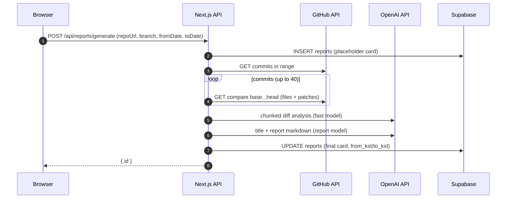

# git-report 프로젝트 설명서

GitHub 저장소의 특정 브랜치/기간(KST 기준) 커밋 변경(diff)을 수집하고, OpenAI로 요약·구조화해 “공유 가능한 변경 리포트”를 생성하는 Next.js 웹앱이다.

## 1) 문제 정의와 목표

- 문제: PR/릴리즈/스프린트 단위로 “무슨 변경이 있었는지”를 빠르게 파악하기 어렵다.
- 목표: 커밋 diff 기반으로 변경 사항을 요약하고, 흐름(mermaid)과 Markdown 리포트를 생성해 팀 내 공유를 단순화한다.

## 2) 핵심 기능(현재 구현)

### 2.1 리포트 생성

- 입력: GitHub Repo URL, 브랜치, 기간(from/to, 날짜), 시간은 KST 00:00~23:59로 고정
- 처리:
  - GitHub REST API로 기간 내 커밋을 가져온 뒤, 각 커밋의 parent→head compare로 파일 diff를 수집
  - diff를 텍스트로 압축(compact)하고 길이에 맞게 chunking하여 OpenAI에 분석 요청
  - chunk 결과를 합쳐 요약/흐름/성능 힌트/벤치마크 항목을 구성한 뒤 최종 “리포트 카드” 생성
- 결과: Supabase(PostgreSQL)에 저장하고 `/reports/[id]`로 이동

### 2.2 리포트 조회/목록

- 최근 리포트 목록 조회(기본 30개)
- 리포트 상세 조회

### 2.3 공유(읽기 전용)

- 리포트 상세에서 share slug를 생성하고 `is_public=true`로 전환
- 공유 링크(`/share/[slug]`)로 누구나 읽기 전용 뷰 접근 가능

### 2.4 비교(기본형)

- 2개 리포트 ID를 받아 간단 비교 Markdown을 반환(현재는 기여자 수 등 최소 정보)

### 2.5 브랜치 목록 조회

- Repo URL을 입력하면 브랜치 목록을 불러와 선택할 수 있다.

## 3) 페이지/라우팅

- `/`: 리포트 생성(Repo URL/브랜치/기간)
- `/reports/[id]`: 리포트 상세(머메이드/마크다운/공유 액션 등)
- `/share/[slug]`: 공유 리포트(읽기 전용)

## 4) 시스템 아키텍처

### 4.1 구성 요소

- Frontend: Next.js(App Router) + React + TypeScript + TailwindCSS
- Backend: Next.js Route Handlers(Serverless / Node.js runtime)
- Storage: Supabase(PostgreSQL)
- External: GitHub REST API, OpenAI API

### 4.2 데이터 흐름(리포트 생성)



## 5) 데이터 모델(Supabase)

### 5.1 reports

- 리포트 본문은 `card` JSONB에 저장한다.
- 공유는 `is_public`과 `share_slug`로 제어한다.

주요 컬럼:

| 컬럼 | 타입 | 설명 |
|---|---|---|
| id | uuid | 리포트 ID |
| repo_url | text | GitHub repo URL |
| branch | text | 브랜치 |
| from_kst / to_kst | text | 표시용 기간(KST label) |
| is_public | boolean | 공개 여부 |
| share_slug | text | 공유 슬러그(유니크) |
| card | jsonb | 리포트 카드(제목/기여자/mermaid/markdown/옵션 필드) |
| created_at | timestamptz | 생성 시각 |

### 5.2 report_run_logs

- 생성 과정 로그(현재는 start/done 정도) 저장용 테이블

## 6) API 명세(요약)

### 6.1 브랜치 조회

`POST /api/github/branches`

Request:

```json
{ "repoUrl": "https://github.com/org/repo" }
```

Response:

```json
{ "branches": ["main", "develop"] }
```

### 6.2 리포트 생성

`POST /api/reports/generate`

Request:

```json
{
  "repoUrl": "https://github.com/org/repo",
  "branch": "main",
  "fromDate": "2026-01-01",
  "toDate": "2026-01-07"
}
```

Response:

```json
{ "id": "uuid" }
```

### 6.3 리포트 목록

`GET /api/reports/list`

Response:

```json
{ "reports": [{ "id": "uuid", "title": "…", "repoUrl": "…", "branch": "…", "fromKst": "…", "toKst": "…", "createdAt": "…" }] }
```

### 6.4 리포트 조회

`GET /api/reports/:id`

### 6.5 공유 링크 생성

`POST /api/reports/:id/share`

Response:

```json
{ "shareUrl": "https://<host>/share/<slug>" }
```

### 6.6 공개 리포트 조회(내부용)

`GET /api/reports/public/:slug`

### 6.7 비교

`POST /api/reports/compare`

Request:

```json
{ "leftReportId": "uuid", "rightReportId": "uuid" }
```

Response:

```json
{ "markdown": "..." }
```

## 7) 환경변수

| 키 | 필수 | 설명 |
|---|---:|---|
| OPENAI_API_KEY | Y | OpenAI 호출 |
| OPENAI_MODEL_FAST | N | diff chunk 분석용 모델(기본 gpt-4o-mini) |
| OPENAI_MODEL_REPORT | N | 최종 리포트 생성용 모델(기본 gpt-4o) |
| SUPABASE_URL | Y | Supabase 프로젝트 URL |
| SUPABASE_SERVICE_ROLE_KEY | Y | 서버에서 DB 접근(주의: 절대 클라이언트에 노출 금지) |
| GITHUB_TOKEN | N | GitHub API rate limit 완화/Private repo 접근(환경변수 기반) |

## 8) 제한/운영 고려사항

- GitHub API: 토큰 없이 rate limit에 쉽게 걸릴 수 있다. Private repo는 환경변수 토큰이 사실상 필수다.
- 비용/지연: 커밋 수가 많을수록 compare 호출이 증가하고 OpenAI 호출이 늘어난다.
- 데이터 품질: patch가 없는 파일(바이너리/대용량)은 요약 품질이 떨어질 수 있다.
- 공개 리포트: `is_public=true`가 되면 slug를 아는 누구나 열람 가능하므로, 민감 정보가 포함된 저장소에는 사용을 주의한다.

## 9) “핵심 기능 추가” 제안(로드맵)

현재 구현을 기반으로 제품의 핵심 가치를 강화하기 위한 기능 확장 제안이다.

### 9.1 인증/권한(필수급)

- GitHub OAuth 로그인 및 사용자별 토큰 위임(개인/조직/Private repo 안정 지원)
- 리포트 접근 제어: 비공개 공유(서명 URL, 만료, 패스코드), 팀/조직별 권한

### 9.2 생성 파이프라인 고도화

- 중복 생성 방지 및 캐시: (repoUrl, branch, fromDate, toDate) 키로 결과 재사용
- Background job: 생성 요청을 비동기 작업으로 분리하고 진행 상태/재시도/실패 원인 UI 제공
- webhook/PR 연동: PR 오픈/머지 시 자동 리포트 생성 및 코멘트/체크로 결과 연결

### 9.3 비교 기능 강화

- 변경 규모/리스크/핵심 모듈 변화량 등 지표화(트렌드 포함)
- 성능/벤치마크 입력 스키마 명확화 및 히스토리 비교
- “요약 비교”뿐 아니라 “차이점(What changed between reports)” 중심 비교 리포트 생성

### 9.4 공유/내보내기

- PDF/HTML export, Notion/Confluence/Slack 공유
- 리포트 템플릿(팀별 섹션/톤/포맷) 커스터마이징

### 9.5 운영/보안

- rate limit 및 abuse 방지(요청 제한, per-user quota, 비용 가드레일)
- Supabase RLS/정책 정비 및 감사 로그, 에러/성능 모니터링

